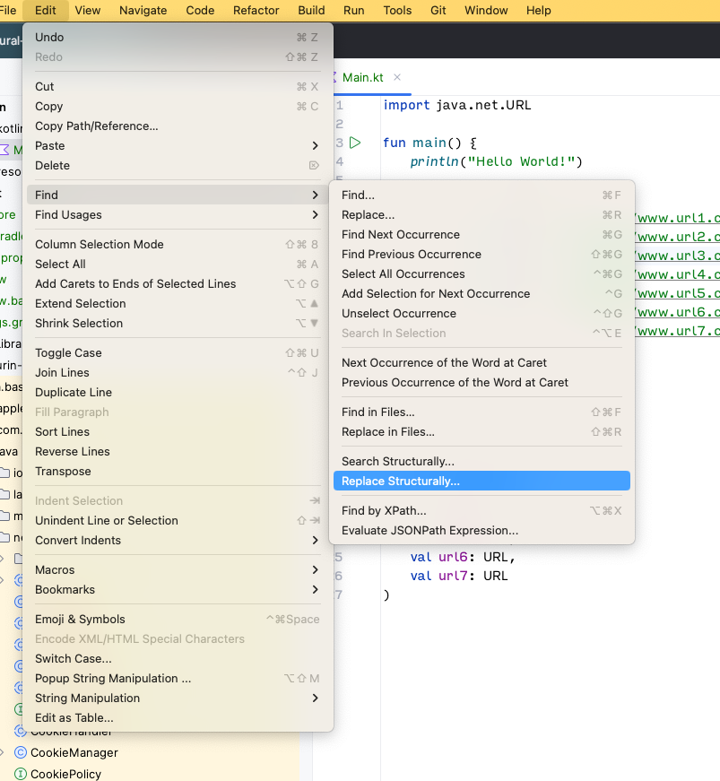
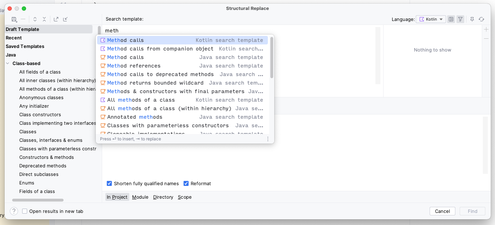
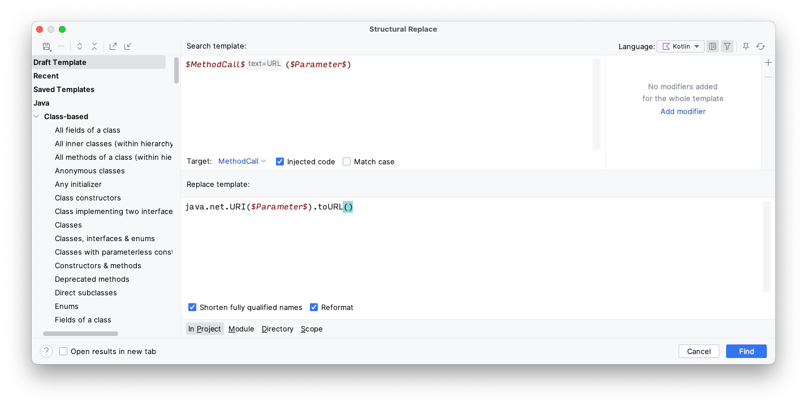
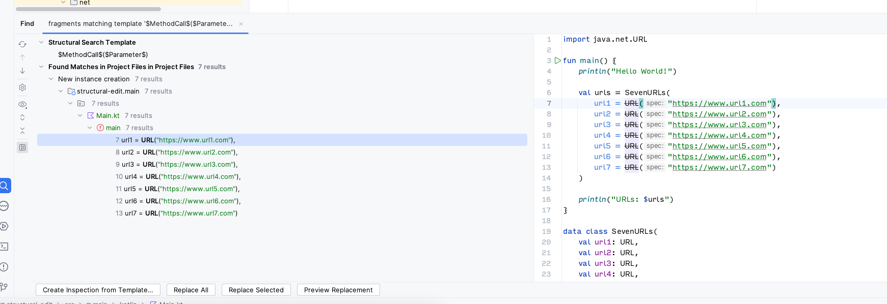

Her om dagen oppdaterte jeg java-versjonen i prosjektet jeg jobber med, og oppdaget at konstruktøren til URL var _deprecated_:

```java
/**
 * Creates a {@code URL} object from the {@code String}
 * representation.
 * <p>
 * This constructor is equivalent to a call to the two-argument
 * constructor with a {@code null} first argument.
 *
 * @param      spec   the {@code String} to parse as a URL.
 * @throws     MalformedURLException  if no protocol is specified, or an
 *               unknown protocol is found, or {@code spec} is {@code null},
 *               or the parsed URL fails to comply with the specific syntax
 *               of the associated protocol, or the
 *               underlying stream handler's {@linkplain
 *               URLStreamHandler#parseURL parseURL method} throws
 *               {@code IllegalArgumentException}
 * @see        java.net.URL#URL(java.net.URL, java.lang.String)
 * @deprecated Use {@link URI#toURL()} to construct an instance of URL. See the note on
 * <a href="#constructor-deprecation">constructor deprecation</a> for more
 * details.
 */
@Deprecated(since = "20")
public URL(String spec) throws MalformedURLException {
    this(null, spec);
}
```

Et kjapt søk viste at jeg hadde brukt denne konstruktøren i underkant av 100 ganger, og nå var byggeloggen min full av advarsler om at denne måtte byttes ut. Jeg hadde ikke lyst til å skrive om koden for hånd. Det er tross alt en av de beste grunnene til at vi har datamaskiner, nemlig at de kan gjøre kjedelige oppgaver for oss, både raskere og bedre.

Men hvordan kan jeg skrive om all denne koden automatisk?

# Første forsøk: search and replace, eller kanskje regex?

Det første jeg tenkte på var search and replace. Søk på bruk av URL-konstruktøren, og bytt det ut med `URI(...).toURL()`. Problemet her er at vi bruker `URI` i stedet for `URL`, så importene må oppdateres samtidig. Det får vi ikke gjort med search and replace, så vi er like langt, og må gå gjennom koden for hånd etterpå.

En naturlig forlengelse av denne ideen er regex, men siden jeg ikke ville ha enda flere problemer enn jeg allerede hadde, lot jeg den strategien ligge.


# Structural search and replace

Fra noen smarte kollegaer i Kantega fikk jeg et tips om at det finnes en bedre search and replace i IDEA, som heter _Search structurally..._ og _Replace structurally..._. [Her er det Jetbrains selv sier om det:](https://www.jetbrains.com/help/idea/structural-search-and-replace.html)

> A conventional search process does not take into account the syntax and semantics of the source code. Even if you use regular expressions, IntelliJ IDEA still treats your code as a regular text. The structural search and replace (SSR) actions let you search for a particular code pattern or grammatical construct in your code considering your code structure.

Dette hørtes lovende ut! Search and replace som ikke bare ser på koden som tekst, men som i tillegg vet om strukturen og gramatikken i språket du jobber med.

# Et eksempel

```kotlin
import java.net.URL

fun main() {
    println("Hello World!")

    val urls = SevenURLs(
        url1 = URL("https://www.url1.com"),
        url2 = URL("https://www.url2.com"),
        url3 = URL("https://www.url3.com"),
        url4 = URL("https://www.url4.com"),
        url5 = URL("https://www.url5.com"),
        url6 = URL("https://www.url6.com"),
        url7 = URL("https://www.url7.com")
    )

    println("URLs: $urls")
}

data class SevenURLs(
    val url1: URL,
    val url2: URL,
    val url3: URL,
    val url4: URL,
    val url5: URL,
    val url6: URL,
    val url7: URL
)
```

I dette lille eksempelet har vi syv URL-er samlet i en dataklasse, som blir printet ut. Et tøysete eksempel, men nok for å vise hvordan dette fungerer. I koden jeg jobbet med hadde jeg i underkant av hundre steder som måtte oppdateres, og rundt femten forskjellige filer.

Målet er å oppdatere alle referansene til `URL(...)`, og bytte de ut med `URI(...).toURL()`. I tillegg må vi fikse importene, sånn at java.net.URI blir importert, hvis det trengs, og java.net.URL blir fjernet, hvis den ikke brukes lenger.

Det første vi gjør er å velge "Replace structurally..." i Edit-menyen.



Da får vi opp et nytt vindu hvor vi kan søke og erstatte kode, som vi er kjent med fra vanlig search and replace. Det som er nytt her er at vi har _Code completion_ i søkevinduet, og kan velge blant mange ferdig definerte kodestrukturer som vi vil søke etter. Vi velger _Method calls_ i kotlin.



Vi får presentert følgende mal: `$Before$.$MethodCall$($Parameter$)`. `$Before$` trenger vi ikke, så den fjerner vi. Når vi klikker på `$MethodCall$` kan vi velge å legge til _modifiers_, for å filtrere ut de metodekallene vi er ute etter. Vi legger til en ny _modifier_ ved å klikke på "+" helt til høyre, velger "Text" og skriver inn "URL".

`$Parameter$` er naturlig nok parameterene til metodekallet. I vårt tilfelle er vi interessert i konstruktørkallet med ett parameter, så vi endrer "Count" til å ha minimum 1 og maksimum 1 parameter.

I tekstfeltet under kan vi skrive inn en _Replace template_, som er en mal for hvordan den nye koden skal se ut. Vi vil endre metodekallet fra `URL` til `URI`, og vi vil kalle metoden `toURL()` på den nye instansen. Her kan vi bruke `$Parameter$` for å få den samme parameteren som i søkeresultatet. Malen vår blir derfor `java.net.URI($Parameter$).toURL()`.

I tillegg huker vi av _Shorten fully qualified names_ under tekstfeltet. Da blir `java.net.URI` skrevet om til `URI`, og den riktige importen blir lagt til.





Når vi nå klikker på _Find_ får vi opp et nytt vindu som finner alle kallene til URL-konstruktøren, og så er det bare å velge _Replace all_ for å erstatte dem med URI-konstruktøren i stedet. Magisk ✨

# Konklusjon

Dette var en nydelig oppdagelse. Jeg trenger ikke å ha dårlig samvittighet for alle advarslene i koden som jeg burde ha gjort noe med, og jeg trenger ikke å skrive om masse kode for hånd, noe som hadde vært utrolig kjedelig. Datamaskiner skal helst ta seg av de kjedelige oppgavene, så vi kan bruke tida vår på mer interessante oppgaver. Her har IDEA løst det på en suveren måte, selv om det var litt vanskelig å finne.

Det er mange flere muligheter i dette søket, som helt sikkert kan løse mange andre problemer. Husk på det til neste gang du kvier deg for å oppdatere masse kode i prosjektet ditt. Kanskje IDEA kan gjøre det for deg? 📝
